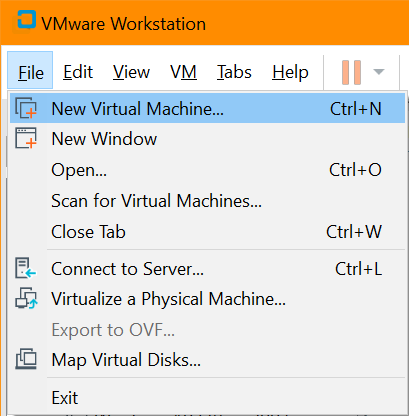
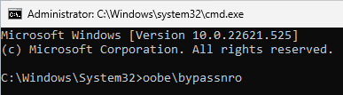

# Install Windows 11 as Guest OS on VMware Workstation

Purpose of this repository is to provide one way (of the many available in the Internet) to install Windows 11 as Guest OS on VMware Workstation, where either or both of the host machine's resources and/or the VMware version do ***NOT support [Windows 11 System Requirements](https://www.microsoft.com/en-in/windows/windows-11-specifications)***.


There are many guides which use script and/or binary tool which you need to download and execute, in order to install Windows 11 Guest OS ***without*** fulfilling the requirements.
However, from security perspective this MAY NOT be a good option since you MAY NOT trust those scripts and/or binary tools.
This repository provides a step by step procedure without needing external script or external binary tool.
All you need is the original installation `.iso` file from Microsoft.

<br><br><br>

The procedure on this repository were tested with the following components:
- [ ] Host: Windows 10 Home (version 22H2)
- [ ] Virtualization Technology: VMware Workstation Pro (version 15.5.7)
- [ ] Guest OS: Windows 11 Pro (version 22H2)

Note that both Microsoft and VMware keep updating their software, so when the versions you use differ, understandably you may stumble on error(s) not stated in this repository.

<br><br><br>

Download the Windows 11 `.iso` file from Microsoft's [Download Windows 11](https://www.microsoft.com/software-download/windows11) page.
The `.iso` file used for tests on this repository is the one stated on the table below:
| Language | SHA256 hash values for the `.iso` files |
| --- | --- |
| English International 64-bit | F115CD6B31734BC091BC94B964D5AD43984285BF229503481E2F7EF94AB7140E |

<br><br><br>

Once you have the Windows 11 `.iso` file, start to create the New Virtual Machine :



VMware Workstation 15 does not recognize Windows 11, so we have to use "Custom (advanced)" process.


Use Windows 10 as "template".


Since we are not going to comply with the Windows 11 Requirements; we'll use the practical firmware type BIOS.


Specify the CPU and Memory to be allocated for the new Windows 11 Guest OS, as needed or as available.
The procedure described in this repository will make Windows 11 installation bypass checking the amount of Memory and number of CPU cores and speed.


Detaching the new Windows 11 Guest OS from Internet is optional.
However I prefer to detach the new Windows 11 Guest OS while I am installing/configuring/removing the bloatware which Microsoft has put into the newly installed Windows 11 OS.
We can always re-attach the new Windows 11 Guest OS to the network/Internet later.


Once you reach the step depicted on the screen capture above, click `Finish` and the (still empty) Guest will be created.

<br><br><br>

Before you spin up the newly created (empty) Guest (i.e. before you start the Windows 11 OS installation process), you may want to review and change the virtual hardware configuration.
If you follow exactly the guide above to the letters, the name of the newly created Guest will be "Windows 11 Professional 64 Bits".
On the newly created "Windows 11 Professional 64 Bits" Guest, click on the `Edit virtual machine settings`.


If you do not have virtual "Printer" configured, you can remove this virtual device from the "Windows 11 Professional 64 Bits" Guest.
Select the "Printer", click `Remove` button below, and then click `OK`.

Whether you have or not have the virtual "Printer" configured, this step is optional.
Removing the virtual "Printer" will prevent VMware from poping up messages regarding the virtual "Printer".


On "Options" tab and "Advanced" menu, you can have VMware to "Clean up disks after shutting down this virtual machine".
This is a nice feature to utilize, to auto-maintenance the Guest's disks after each shutdown, so the disks won't get bloated in size and waste storage spaces.


<br><br><br>

After you're done reviewing and/or changing the virtual hardware configuration, click `Power on this virtual machine` to turn-on "Windows 11 Professional 64 Bits" Guest.




ReBoot !!!

Blah Blah Blah


During installation of Windows 11, you'll see a message "This PC can't run Windows 11." and the installation is blocked due to lack of resources or missing hardware requirements.


- [ ] When you see the above message, press `shift`+`F10` (Or `shift`+`fn`+`F10`) on your keyboard at the same time to launch a command prompt. At the command prompt, type `regedit` and press `enter` to launch the Windows Registry Editor.
- [ ] When the Registry Editor opens, navigate to: `HKEY_LOCAL_MACHINE\SYSTEM\Setup`, Right-click on the `Setup` key and select `New` > `Key`.
- [ ] When prompted to name the key, Type `LabConfig` and press `enter`.
- [ ] Now right-click on the `LabConfig` key and select `New` > `DWORD (32-bit)` value and create a value named `BypassTPMCheck`, and set its data to `1`.
- [ ] Now right-click on the `LabConfig` key and select `New` > `DWORD (32-bit)` value and create a value named `BypassSecureBootCheck`, and set its data to `1`.
- [ ] Now right-click on the `LabConfig` key and select `New` > `DWORD (32-bit)` value and create a value named `BypassRAMCheck`, and set its data to `1`.
- [ ] Now right-click on the `LabConfig` key and select `New` > `DWORD (32-bit)` value and create a value named `BypassStorageCheck`, and set its data to `1`.
- [ ] Now right-click on the `LabConfig` key and select `New` > `DWORD (32-bit)` value and create a value named `BypassCPUCheck`, and set its data to `1`.


- [ ] Once you configure the above keys and their respective values under the `LabConfig` key, close the Registry Editor, and then type `exit` in the Command Prompt followed by `enter` to close the window. You will now be back at the message stating that the PC can't run Windows 11. Click on the back button in the Windows Setup dialog, as shown below. Press the back button in Windows setup.
- [ ] You will now be back at the screen prompting you to select the version of Windows 11 you wish to install. You can now continue with the setup, and the hardware requirements will be bypassed, allowing you to install Windows 11.


- [ ] Blah, blah . . . press `shift`+`F10` (Or `shift`+`fn`+`F10`) on your keyboard at the same time to launch a command prompt. At the command prompt, type `oobe\bypassnro` and press `enter`. the guest os will reboot/restart


References:
- [ ] [Installing Windows 11 as a Guest OS on VMware Workstation](https://kb.vmware.com/s/article/86207)


<br><br><br>

***

<br><br><br>
```
╔═╦═════════════════╦═╗
╠═╬═════════════════╬═╣
║ ║ End of Document ║ ║
╠═╬═════════════════╬═╣
╚═╩═════════════════╩═╝
```
<br><br><br>


